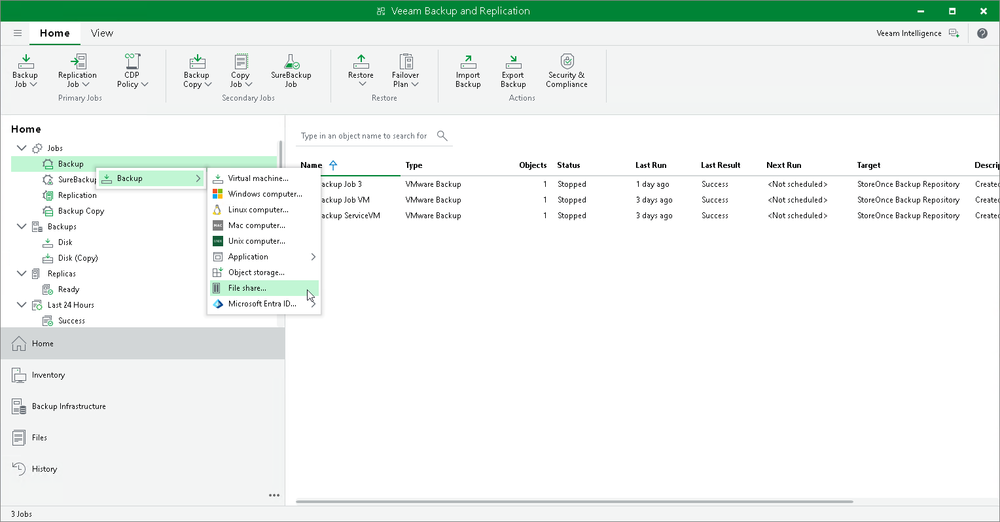

# Step 1. Launch New File Backup Job Wizard

To launch the New File Backup Job wizard, do one of the following:

* On the Home tab, click Backup Job > File Share.
* Open the Home view. Right-click in the working area, and select Backup > File share.
* Open the Home view. In the inventory pane, right-click the Jobs node and select Backup > File share.
* You can quickly add the file share to an already existing job. Open the Inventory view. Under the Unstructured Data (File Shares – for version 12) node in the inventory pane, select File Shares. In the working area, right-click the file share you want to back up and select Add to backup job > name of the job.

