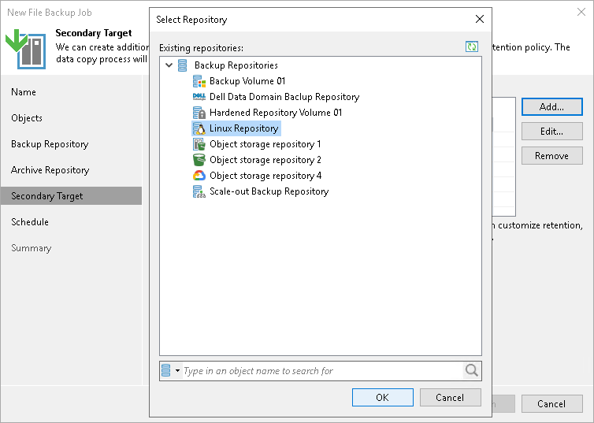
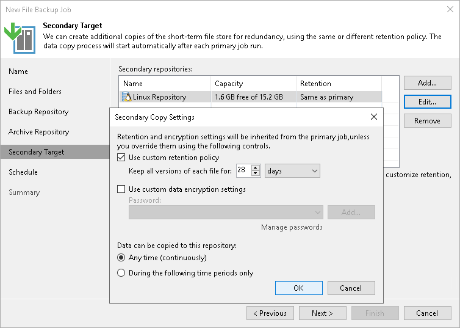

# Step 7. Specify Secondary Repository Settings

At the Secondary Target step of the wizard, you can specify a secondary repository that will be used to store additional copies of backup files from the backup storage for redundancy. To learn what storage types you can assign the role of the secondary repository to, see [Storage Repositories](unstructured_data_backup_infrastructure.md#backup_repository) in the Backup Infrastructure for Unstructured Data Backup section.

If you add a secondary repository, Veeam Backup & Replication will create a separate job for backup copy to it. The data copy process will start automatically after each primary job runs.

|  |
| --- |
| Note |
| This step is available, if you select the Configure secondary destinations for this job check box at the [Backup Repository](file_share_backup_job_storage.md) step of the wizard. |

To add a secondary repository:

1. Click Add.
2. From the list of existing repositories, select a repository that will keep additional copy of the backup files. You can add several secondary repositories for copying files of the primary backup job. To quickly find the repository, use the search field at the bottom of the wizard.

1. By default, retention and encryption settings for the secondary target repository are inherited from the primary job. To customize them, select the necessary repository in the Secondary repositories list and click Edit.

* To enable custom retention settings:

1. Select Use custom retention policy.
2. Specify how long all versions of each file will be kept in the secondary repository.

* To specify encryption settings different from those of the primary repository:

1. Select Use custom data encryption settings.
2. In the Password field, select a password that you want to use for encryption. If you have not created the password beforehand, click Add or use the Manage passwords link to specify a new password. For more information, see [Password Manager](password_manager.md).

If the backup server is not connected to Veeam Backup Enterprise Manager and does not have the Veeam Universal License or a legacy socket-based Enterprise or Enterprise Plus license installed, you will not be able to restore data from encrypted backups in case you lose the password. Veeam Backup & Replication will display a warning about it. For more information, see [Decrypting Data Without Password](decrypt_without_pass.md).

* Configure time intervals at which the data can be copied to the secondary repository.

* If you select the Any time (continuously) option, Veeam Backup & Replication will copy backup files to the secondary repository as soon as the primary file backup job completes.
* If you want to specify time periods when it is permitted to start copying backup files to the secondary repository, select the During the following time periods only option and configure allowed and prohibited hours. These periods do not work as the backup window, so they will not cause the file backup copy to fail.

