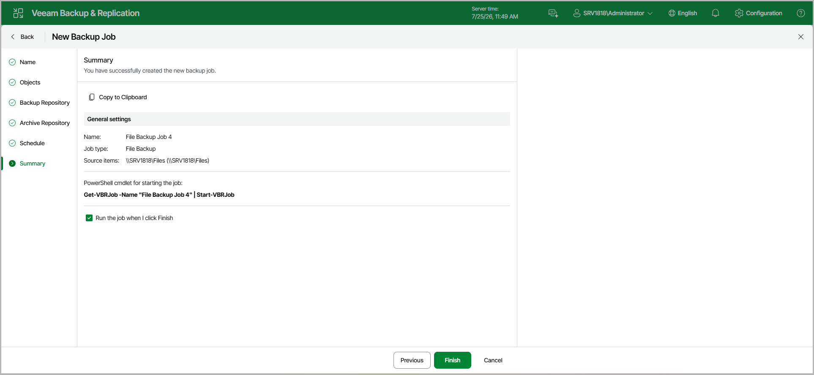

# Step 8. Finish Working with Wizard

At the Summary step of the wizard, complete the procedure of backup job configuration.

1. Review details of the backup job.
2. If you want to start the job right after you finish working with the wizard, select the Run the job when I click Finish check box.
3. Click Finish to close the wizard.

Page updated 2026-07-25

