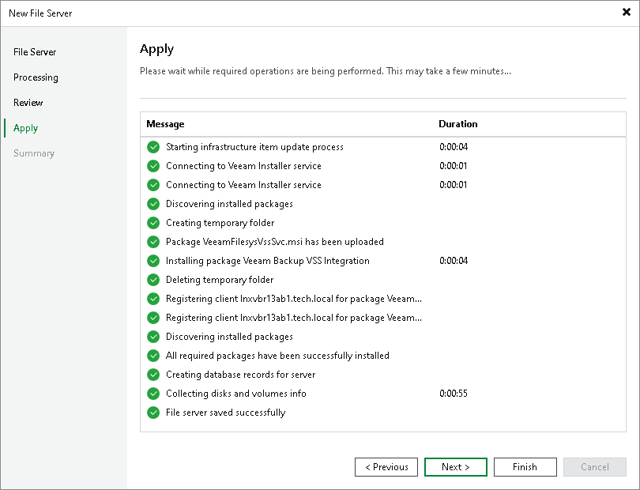

# Step 5. Apply File Share Settings

At the Apply step of the wizard, wait till Veeam Backup & Replication installs and configures all required components. Click Next to complete the procedure of the file share role assignment to the managed file server.

