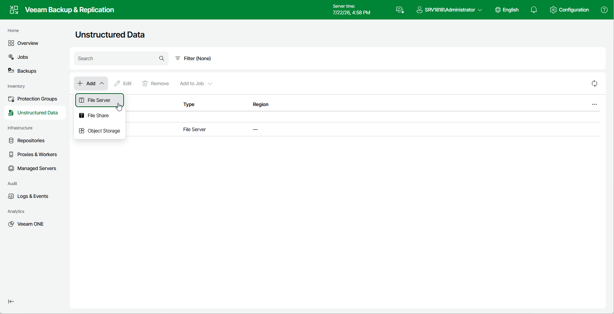

# Step 1. Launch New File Server Wizard

To launch the Add File Server wizard, do the following:

1. Open the Unstructured Data node in the management pane.
2. Click Add.
3. From the drop-down list, select File Server.

Page updated 2026-07-22

