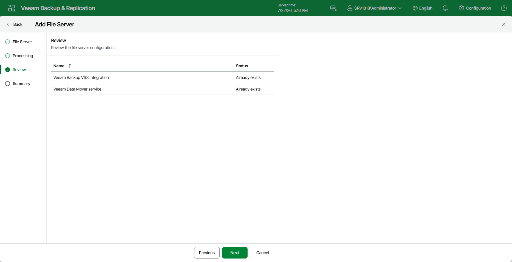

# Step 4. Review Components to Install

At the Review step of the wizard, review what Veeam Backup & Replication components are already installed on the server and click Apply to start installation of missing components.

Page updated 2026-07-22

