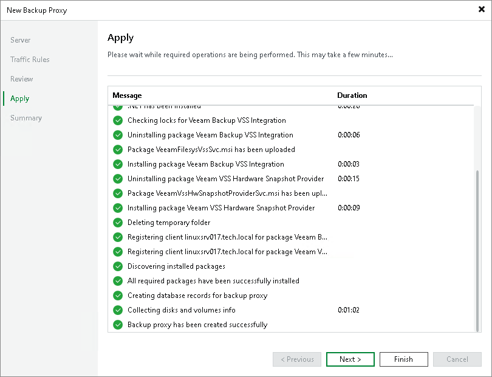

# Step 5. Apply Backup Proxy Settings

In this article

At the Apply step of the wizard, wait till Veeam Backup & Replication installs and configures all required components. Click Next to complete the procedure of the backup proxy role assignment to the server.

Page updated 11/15/2024

Page content applies to build 13.0.1.1071
