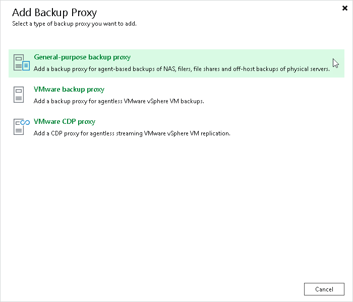

# Step 1. Launch New Backup Proxy Wizard

To launch the New Backup Proxy wizard, do the following:

1. Open the Backup Infrastructure view.
2. In the [inventory pane](vbr_ui.md), right-click the Backup Proxies node and select Add proxy. Alternatively, you can click Add Proxy on the ribbon.
3. In the Add Backup Proxy window, select General-purpose backup proxy.

