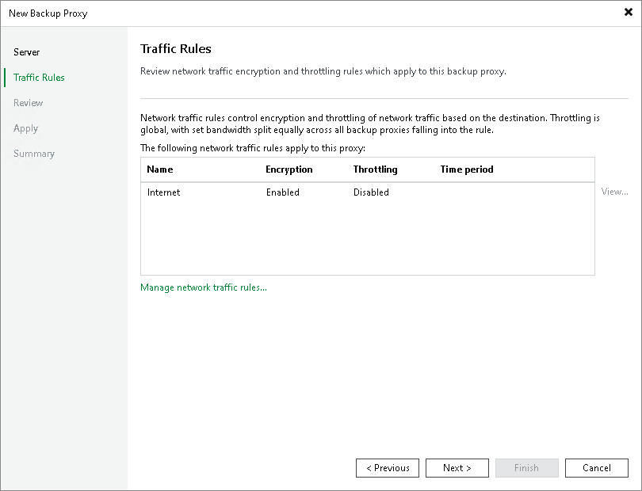

# Step 3. Configure Traffic Rules

At the Traffic Rules step of the wizard, configure network traffic rules. These rules help you throttle and encrypt traffic transferred between backup infrastructure components. For more information, see [Configuring Network Traffic Rules](network_rules.md).

The list of network traffic rules contains only rules applied to the backup proxy: its IP address falls into the IP range configured for the rule.

To view settings configured for the rule:

1. Select the rule in the list.
2. Click View. The View Network Traffic Rule window will display settings configured for the rule.

To modify network traffic settings:

1. Click the Manage network traffic rules link.
2. The Global Network Traffic Rules window will display the full list of all existing global network traffic rules.
3. Select the rule that you want to modify and click Edit. For more information on how to configure network traffic rules, see [Configuring Network Traffic Rules](network_rules.md).

