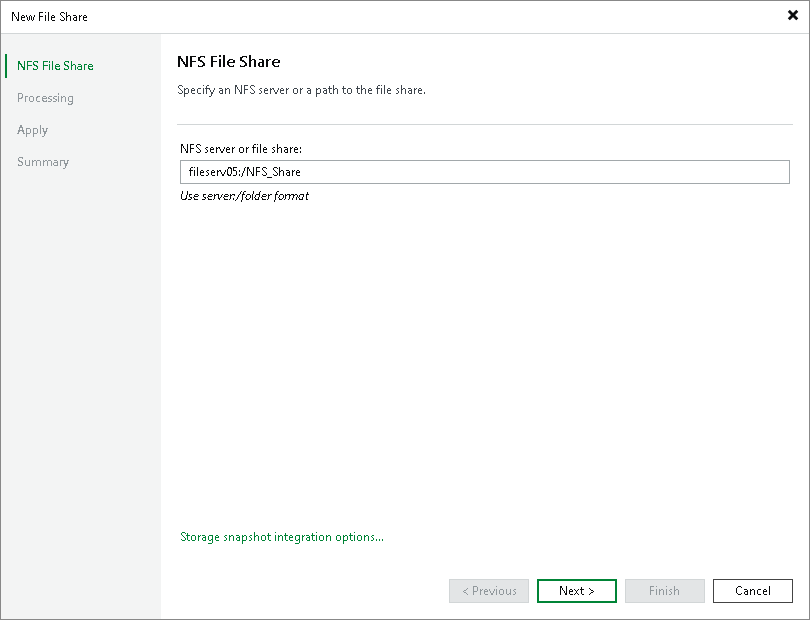

# Step 2. Specify Path to NFS File Share

At the NFS File Share step of the wizard, specify the path to an NFS file share in the server:/folder format.

You can add the root server folder in the server:/format to protect all NFS file shares residing on this server. You can specify the IPv4 or IPv6 address of the server. Note that you can use IPv6 addresses only if IPv6 communication is enabled as described in the [IPv6 Support](https://helpcenter.veeam.com/docs/vbr/userguide/ipv6.html?ver=13) section.

After that, create a single file backup job to protect the added server, as described in the [Creating File Backup Jobs](https://helpcenter.veeam.com/docs/vbr/userguide/file_share_backup_job.html?ver=13) section. Then all NFS file shares added on this server will be automatically processed with the file backup job and protected. If you previously had several separate non-root shared folders residing on the same server and want to switch to using a single root shared folder to cover the same shares, you do not have to run full backups to update data of protected shares. Instead, you can convert existing backups and update existing file backup jobs to protect single root shared folders comprising all other non-root shared folders residing on the same server. To learn more about the conversion, see the [Converting Backups from Non-Root to Root Shared Folders](https://helpcenter.veeam.com/docs/vbr/userguide/convert_backups_nonroot_to_root.html?ver=13) section. Perform the conversion with extreme caution.

