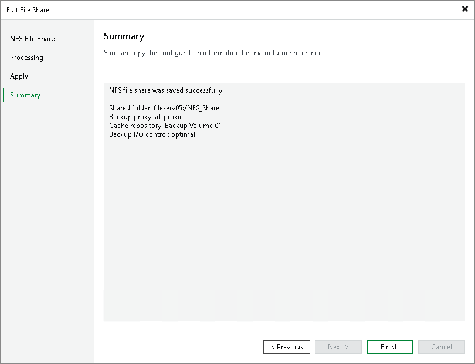

# Step 6. Finish Working with Wizard

In this article

At the Summary step of the wizard, review details of the added NFS share and click Finish to exit the wizard.

Page updated 11/1/2023

Page content applies to build 13.0.1.1071
