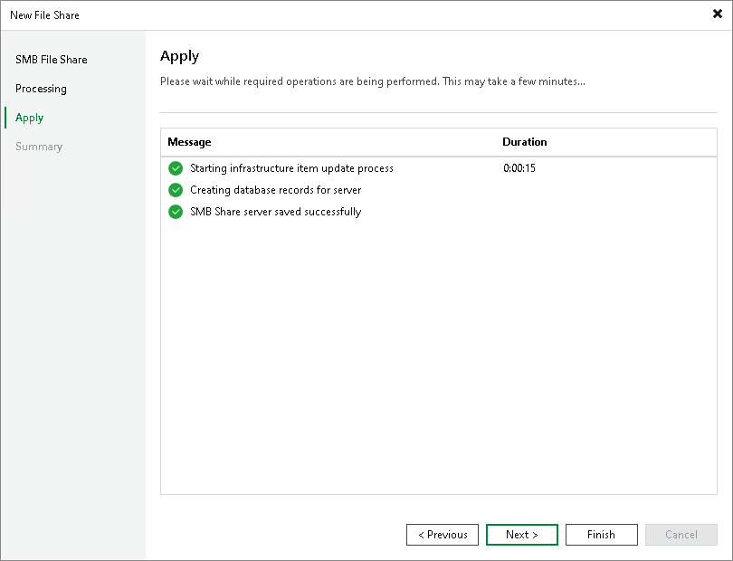

# Step 5. Apply File Share Settings

At the Apply step of the wizard, wait till Veeam Backup & Replication installs and configures all required components and adds the SMB file share to the backup infrastructure. Click Next to proceed.

