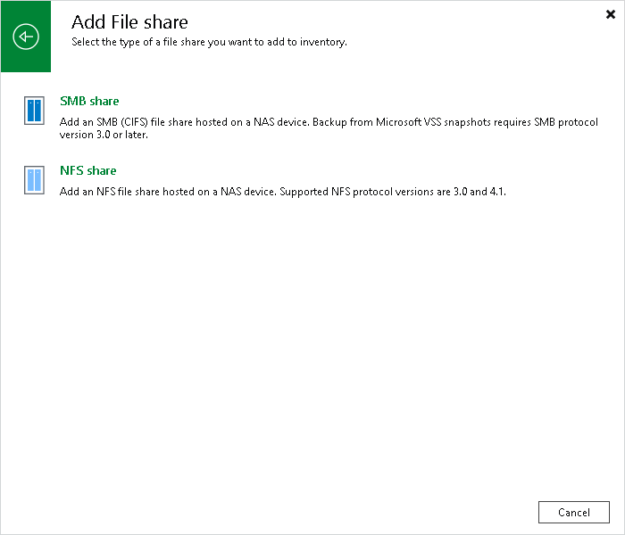

# Step 1. Launch New File Share Wizard

In this article

To launch the New File Share wizard:

1. Open the Inventory view.
2. Do one of the following:

* In the inventory pane, right-click the Unstructured Data node and select Add unstructured data source.
* Select the Unstructured Data node and click Add Data Source on the ribbon.
* Select the Unstructured Data node and click Add Data Sources in the working area.

1. In the Add Unstructured Data Source window, click File share > SMB share.

Page updated 11/1/2023

Page content applies to build 13.0.1.1071
