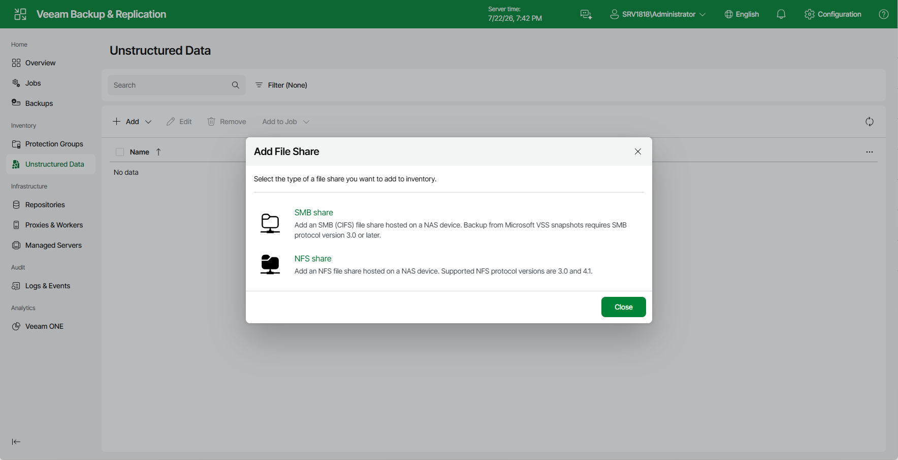

# Step 1. Launch Add SMB Share Wizard

To launch the Add SMB Share wizard, do the following:

1. Open the Unstructured Data node in the management pane.
2. Click Add.
3. From the drop-down list, select File Share.
4. In the Add File Share window, select SMB share.

Page updated 2026-07-22

