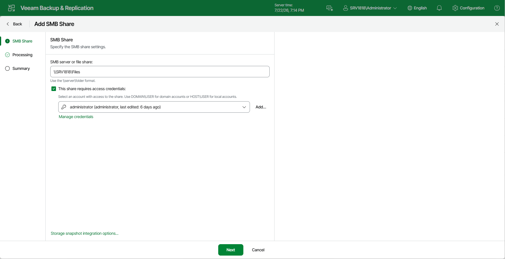
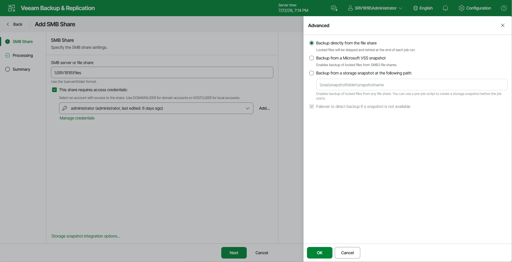

# Step 2. Specify SMB File Share Settings

At the SMB File Share step of the wizard, do the following:

1. [Specify access settings for the SMB file share](#access).
2. [Specify storage snapshot integration settings](#Integration).

Specifying Access Settings for SMB File Share

To specify access settings for the SMB file share, do the following:

1. In the SMB server of file share field, specify the path to an SMB file share in the \\server\folder format. You can specify the IPv4 or IPv6 address of the server. Note that you can use IPv6 addresses only if IPv6 communication is enabled as described in the [IPv6 Support](https://helpcenter.veeam.com/docs/vbr/userguide/ipv6.html?ver=13) section.

You can add the root server folder in the \\server format to protect all SMB file shares residing on this server. After that, create a single file backup job to protect the added server, as described in the [Creating File Backup Jobs](https://helpcenter.veeam.com/docs/vbr/userguide/file_share_backup_job.html?ver=13) section. Then all SMB file shares added on this server will be automatically processed with the file backup job and protected. If you previously had several separate non-root shared folders residing on the same server and want to switch to using a single root shared folder to cover the same shares, you do not have to run full backups to update data of protected shares. Instead, you can convert existing backups and update existing file backup jobs to protect single root shared folders comprising all other non-root shared folders residing on the same server. To learn more about the conversion, see the [Converting Backups from Non-Root to Root Shared Folders](https://helpcenter.veeam.com/docs/vbr/userguide/convert_backups_nonroot_to_root.html?ver=13) section. Perform the conversion with extreme caution.

1. If you must specify user credentials to access the shared folder, select the This share requires access credentials check box. From the Credentials drop-down list, select a credentials record for a user account that has Full Control permissions on the shared folder.

To access the SMB share, you must use an account that meets either of the following requirements:

* If you plan to back up the share, you can use an account with read-only permissions.
* If you plan to back up the share and restore files to it, use an account with read/write permissions.

If you have not set up credentials beforehand, click the Manage accounts link at the bottom of the list or click Add on the right to add the credentials. For more information, see the [Managing Credentials](https://helpcenter.veeam.com/docs/vbr/userguide/managing_credentials.html?ver=13) section.

|  |
| --- |
| Note |
| If the This share requires access credentials check box is not selected, Veeam Backup & Replication uses the computer account of the proxy server to access the file share. |

Specifying Storage Snapshot Integration Settings

You can instruct Veeam Backup & Replication to back up data from Microsoft VSS snapshots or native storage snapshots. During backup jobs, Veeam Backup & Replication will read data of shared files and folders from snapshots, which speeds up backup operations and improves RPOs.

To define if Veeam Backup & Replication will use snapshots for backups:

1. At the SMB File Share step of the wizard, click Storage snapshot integration options.
2. In the Advanced window, select one of the following options:

* To ignore the snapshot functionality, select Backup directly from the file share.

Veeam Backup & Replication will ignore locked files and folders. When creating a backup job, you can configure notifications to list files and folders that are skipped during the backup procedure. For more information see the [Notification Settings](https://helpcenter.veeam.com/docs/vbr/userguide/file_share_backup_job_advanced_notifications.html?ver=13) section.

* To back up files from Microsoft VSS snapshots, select Backup from a Microsoft VSS snapshot.

If you select this option, make sure that the file share and the backup proxy used for the file backup job support SMB protocol version 3.0 or later.

* To back up files from the native storage snapshot, select Backup from a storage snapshot at the following path and specify the path in the \\server\snapshotfolder\snapshotname format to the snapshot stored on the SMB file share. You can specify the IPv4 or IPv6 address of the server. Note that you can use IPv6 addresses only if IPv6 communication is enabled as described in the [IPv6 Support](https://helpcenter.veeam.com/docs/vbr/userguide/ipv6.html?ver=13) section.

If you select this option, you can additionally use custom scripts written by you, for example, to create a snapshot before the backup and remove it after the backup. You can define these scripts when creating a new file backup job, as described in the [Script Settings](https://helpcenter.veeam.com/docs/vbr/userguide/file_share_backup_job_advanced_scripts.html?ver=13) section.

|  |
| --- |
| Note |
| Consider that Veeam Backup & Replication does not take snapshots itself, but it can use a snapshot taken by the storage system. File backup jobs do not trigger the storage snapshot creation and deletion automatically. You can specify the folder where the storage snapshot is stored. In this case file backup jobs can access this folder and read data from the storage snapshot. |

1. Select Failover to direct backup if snapshot is not available if you want Veeam Backup & Replication to read data for backup directly from the file share when the snapshot is unavailable. If you do not select the option and the snapshot is unavailable, the file backup job will stop with a failure.

Page updated 2026-07-22

