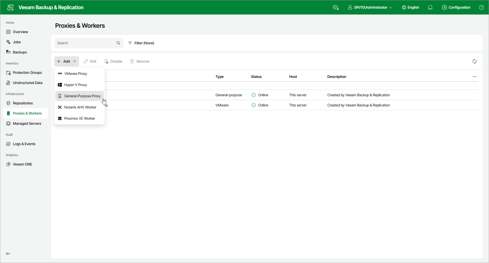

# Step 1. Launch New Backup Proxy Wizard

To launch the New Backup Proxy wizard, do the following:

1. Open the Proxies & Workers node in the management pane.
2. Click Add on the ribbon and select General-Purpose Proxy.

Page updated 2026-07-28

