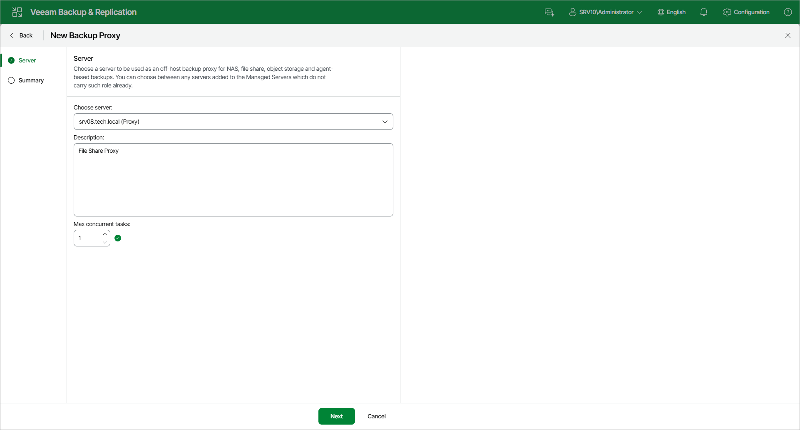

# Step 2. Choose Server

At the Server step of the wizard, specify server settings for the backup proxy:

1. From the Choose server list, select a Microsoft Windows or Linux server to which you want to assign the backup proxy role.

The list of servers contains only those managed servers that are added to the backup infrastructure. For more information, see the [Adding Microsoft Windows Servers](add_windows_server.md) and [Adding Linux Servers](add_linux_server.md) sections.

1. In the Description field, provide a description. The default description contains information about the user who added the backup proxy, date and time when the backup proxy was added.
2. In the Max concurrent tasks field, specify the number of tasks that the backup proxy must handle in parallel. If this value is exceeded, the backup proxy will not start a new task until one of current tasks finishes.

If the number of parallel tasks reaches this value, the backup proxy will not start a new task until one of current tasks completes. Veeam Backup & Replication creates one task per every source file share. The recommended number of concurrent tasks is calculated automatically based on the amount of available resources. Backup proxies with multi-core CPUs can handle more concurrent tasks.

For example, for a 4-core CPU, it is recommended that you specify a maximum of 2 concurrent tasks, for an 8-core CPU — 4 concurrent tasks. When defining the number of concurrent tasks, keep in mind network traffic throughput in the infrastructure.

Page updated 2026-07-28

