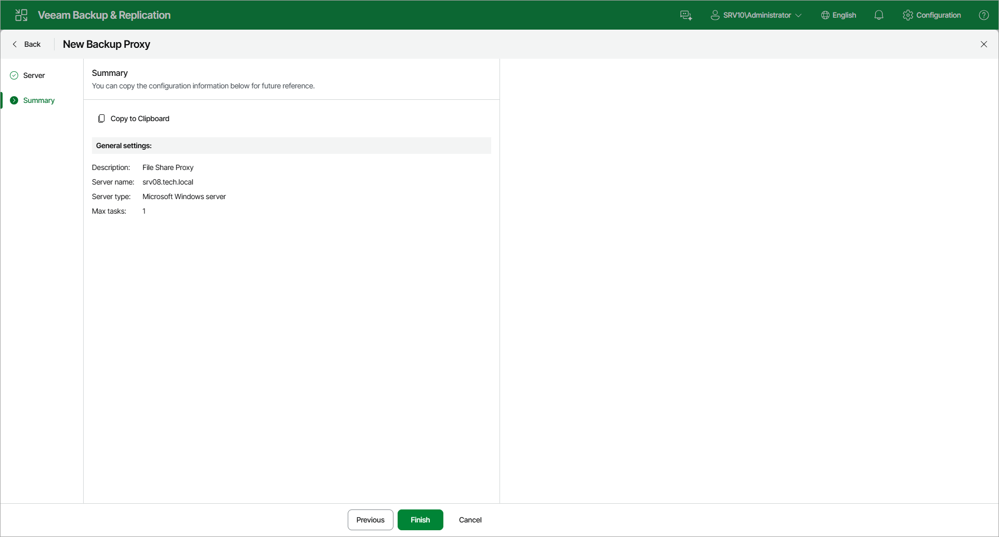

# Step 3. Finish Working with Wizard

At the Summary step of the wizard, review details of the general-purpose backup proxy. Then click Finish to complete the procedure of adding the general-purpose backup proxy to the backup infrastructure. Veeam Backup & Replication will install and configure all required components.

Page updated 2026-07-28

