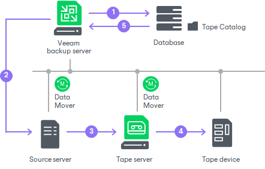
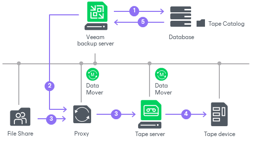
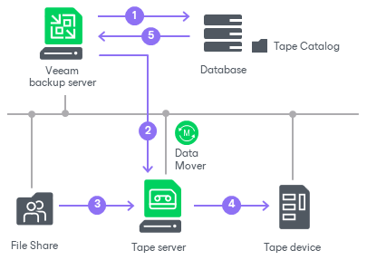

# How File Backup to Tape Works

When Veeam Backup & Replication executes a file to tape job (started manually or on schedule), it performs the following operations:

1. The file to tape job detects files that match the job criteria.
2. The files are queued for archiving. The following scenarios are used:

* If it is a first job run or a scheduled full backup, all selected files are queued for archiving.
* If it is an incremental backup run, Veeam Backup & Replication addresses the Tape Catalog in the Veeam Backup & Replication database to detect if any data has been modified since the latest backup. Detected changes are queued for archiving.

1. Veeam Backup & Replication connects to Veeam Data Movers and starts the data transfer process. The source Data Mover retrieves data from the source servers and target Data Mover sends data to tape.
2. The tape job addresses the media pool that is set for this job as target. The media pool allots tapes for writing data according to the following configuration options:

* Tapes consumption
* Media sets
* Tape retention

1. While tape recording is performed, Veeam Backup service updates data in the Tape Catalog in Veeam Backup database. The Veeam Backup console displays refreshed information about files archived to tape and shows job statistics.

For file to tape jobs from file shares, Veeam Backup & Replication performs similar operations with an addition of a backup proxy server. If you explicitly [specify proxy servers](file_share_backup_nfs_share_processing_settings.md), Veeam Backup & Replication performs file backup to tape in the following way:

In case the file share has automatic backup proxy server selection enabled, the tape server is automatically added to the list of backup proxies for this backup session and is used by default if it has access rights to the file share.

