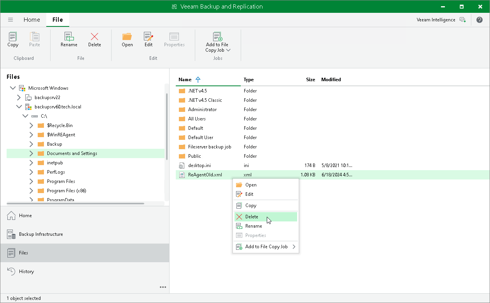

# Editing and Deleting Files

You can edit files and delete them in the Files view of Veeam Backup & Replication. For example, you may want to edit a configuration file of the VM (VMX) or delete files of unused VMs from the storage.

To edit a file:

1. Open the Files view.
2. In the inventory pane, expand the file tree of the necessary server or host.
3. In the working area, select the file and click Edit on the ribbon, or right-click the folder and select Edit.
4. Veeam Backup & Replication will open the selected file in the editor. Make the necessary changes and click Save on the file editor toolbar.

To delete a file:

1. Open the Files view.
2. In the inventory pane, expand the file tree of the necessary server or host.
3. In the working area, select the file and click Delete on the ribbon, or right-click the folder and select Delete.

|  |
| --- |
| Note |
| To delete a folder on VSAN, you must remove the actual folder, not a symbolic link to this folder. The real folder is named with GUID, for example, c07a2953-8096-5b20-a11a-002590c5857c, while the symbolic link contains the folder name, for example, srv02\_vm. If you delete the folder symbolic link, the delete operation will fail, and the folder will not be removed. |

