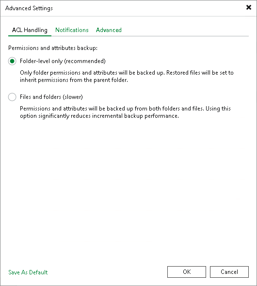

# ACL Handling Settings

To specify how the file to tape job will process permissions and attributes:

1. At the Options step of the wizard, click Advanced.
2. On the ACL Handling tab, define the settings:

* Select Folder-level only (recommended) to back up permissions and attributes from folders only. The restored files will inherit permissions from the target folder.
* Select Files and folders (slower) to back up permissions and attributes from both folders and individual files. This option can significantly reduce the backup performance.

