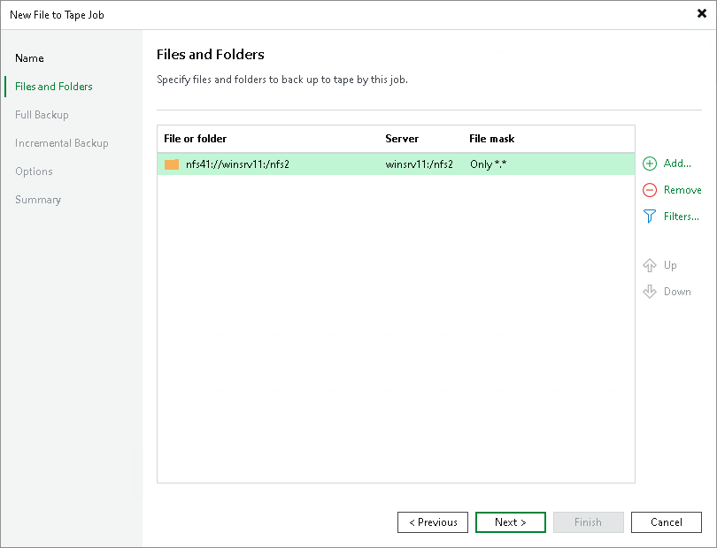

# Step 3. Choose Files and Folders to Archive

At the Files and Folders step of the wizard, select files and folders that you want to back up.

1. Click Add.
2. From the Server drop-down list, select a data source where the necessary files or folders reside:

* If you plan to back up files and folders from a Windows or Linux server, make sure it is added to the backup infrastructure as a file server. For details, see [Adding File Server](tape_adding_file_server.md).
* If you plan to back up files and folders from an SMB or NFS share, make sure it is added as a file share to the inventory. For details, see the [Adding Unstructured Data Source](adding_unstructured_data.md).
* If you plan to back up files and folders from a device supporting the NDMP protocol, make sure it is added as an NDMP server to the tape infrastructure. For details, see [Adding NDMP Servers](adding_ndmp_servers.md).

The account you use to access the target server must have read permissions for the folder and all its child folders.

1. In the Folders tree, select folders you want to backup.

To select multiple folders, hold [Ctrl] and click necessary folders. Although different folders of the same share form separate records in the table, they will be processed by one job task.

|  |
| --- |
| Note |
| On an NDMP server, you can select only volumes. You cannot back up separate files or folders. Also, you cannot use file masks. |

Consider the following:

* Hard links are protected with content included.
* Symbolic links are protected as links, without the content they refer to.

1. In the Files and Folders screen, use the Up and Down buttons on the right to move sources up or down. The sources of the job are processed in the order in which the list displays them.

Including and Excluding Objects

If you add a folder to the job, all the folder contents will be processed. If necessary, you can choose only specific files from the added folder or exclude some subfolders or file extensions. To do so, select a folder in the list and click Filters. To specify filters:

1. To specify inclusion rules, click Add next to the Include masks field:

* Use the Files by mask option to include files with specific extension only. For example, to include all PDF files for processing, enter \*.PDF and click OK.
* Use the Object by path option to include objects based on their path. For example, to include the Report.docx file on a specific NFS share, enter srv075:/share04/Documents/Report.docx and click OK.

1. To specify exclusion rules, click Add next to the Exclude masks field:

* Use the Files by mask option to exclude files with specific extension. For example, to exclude all XLSX files from processing, enter \*.XLSX and click OK.
* Use the Object by path option to exclude objects based on their path. For example, to exclude the Logs folder from all SMB shares on the srv005 server, enter \\srv005\\*\Logs\ and click OK.

|  |
| --- |
| Tip |
| You can follow this set of examples for specifying the path in the Object by path window:   * For SMB shares:  * \\<server>\<share>\<folder>\<file> includes/excludes the file on the specific SMB server. * \\<server>\<share>\<folder>\\* includes/excludes entire folder content on the specific SMB server. * \\<server>\\*\<folder>\\* includes/excludes a folder with the matching name from all SMB shares. * \\<server>\<share>\\* includes/excludes a share with the matching name on the specific SMB server.  * For NFS shares:  * <server>:/<share>/<folder>/<file> includes/excludes the file on the specific NFS server. * <server>:/<share>/<folder>/\* includes/excludes entire folder content on the specific NFS server. * <server>:/\*/<folder>/\* includes/excludes a folder with the matching name from all NFS shares. * <server>:/<share>/\* includes/excludes a share with the matching name on the specific NFS server. |

Exporting and Importing Filters

If you want to reuse the inclusion and exclusion settings in the future, you can save them to an XML file. Click Export these filters at the bottom of the Include and exclude masks window and specify the location for the file. When it is necessary to use the same inclusion and exclusion settings again for a new job, click Import existing list and browse to the file location. Veeam Backup & Replication will import the masks and display them in the Include and exclude masks window.

