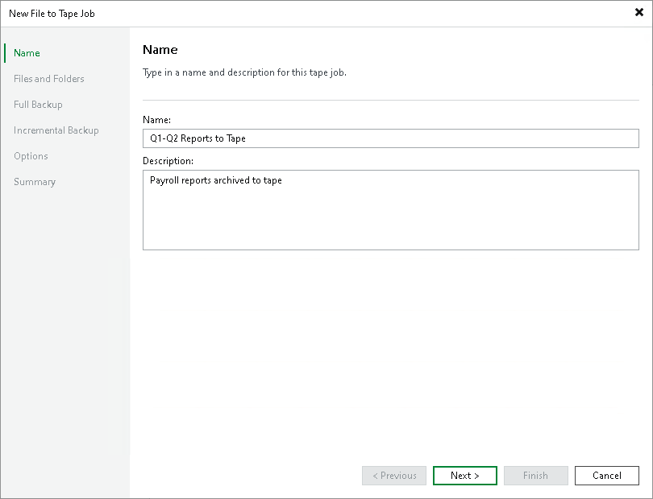

# Step 2. Specify Job Name and Description

In this article

At the Name step of the wizard, you should define basic settings for the created file to tape job.

1. In the Name field, enter a name for the created job.
2. In the Description field, enter a description of the created job. The default description contains information about the user who created the job, date and time when the job was created.

Page updated 5/20/2025

Page content applies to build 13.0.1.1071
