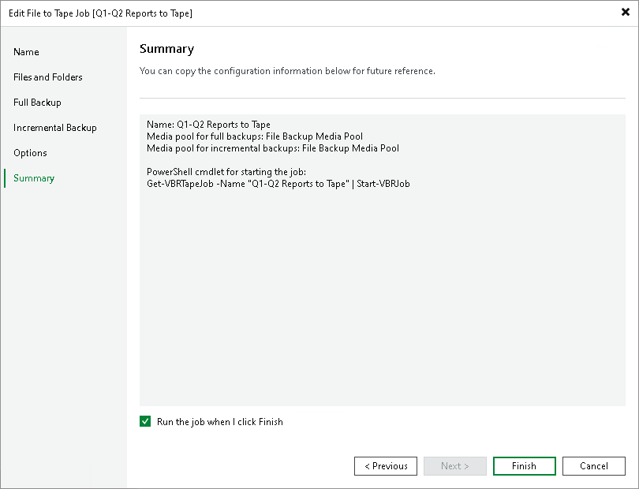

# Step 9. Finish Working with Wizard

In this article

At the Summary step of the wizard, review the settings of the file to tape job. Select the Run the job when I click Finish check box if you want to start archiving file to tape job right after you complete working with the wizard. Click Finish to close the wizard.

Page updated 6/27/2025

Page content applies to build 13.0.1.1071
