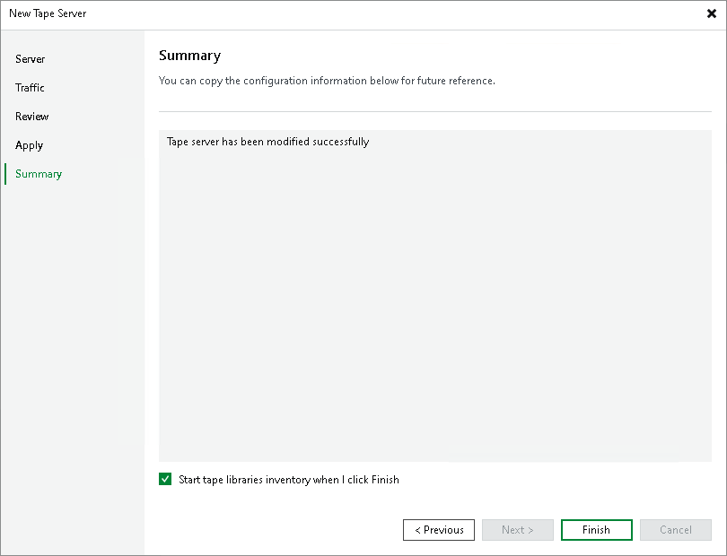

# Step 6. Finish Working with Wizard

At the Summary step of the wizard, finalize the procedure of the tape server configuration. Review details of the added tape server.

To inventory tape libraries connected to the tape server, select the Start tape libraries inventory when I click Finish check box. Veeam Backup & Replication will start the inventory process when you finish working with the wizard. If you do not enable this option, you will have to inventory tape libraries manually. For more information, see [Inventorying Tapes](inventoring_tapes.md).

