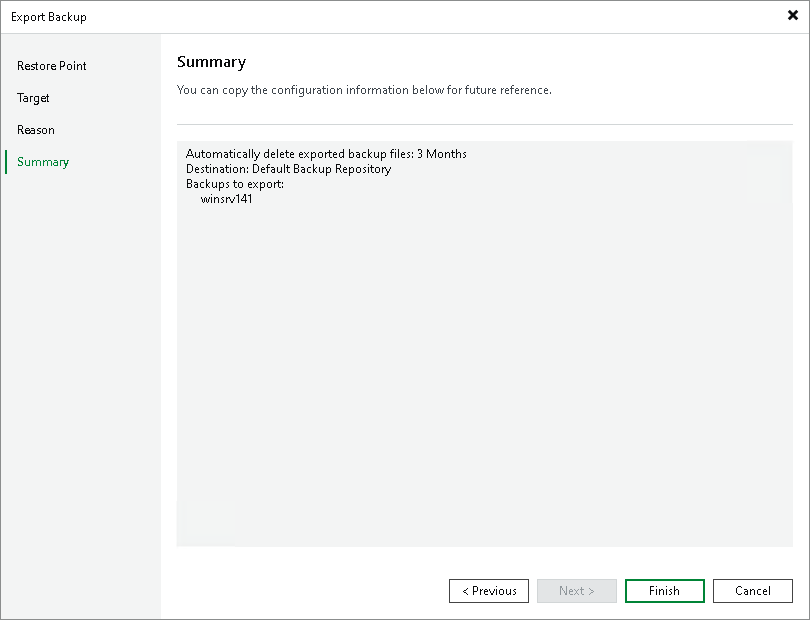

# Step 5. Finish Working with Wizard

At the Summary step of the wizard, review summary information, click Finish and wait until the export session, which is described in section [Viewing Session Statistics](export_statistic_hv.md), is complete.

