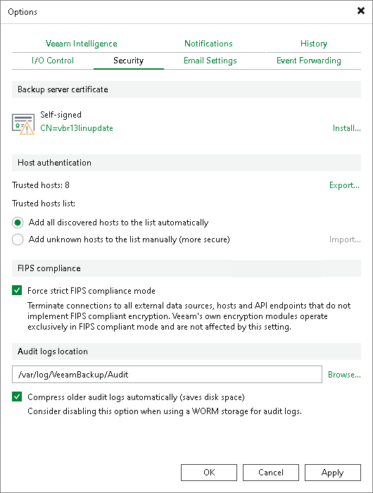

# FIPS Compliance

Veeam Backup & Replication can be configured to run in a FIPS-compliant operation mode.

When this mode is enabled:

* Veeam Backup & Replication uses [platform-provided cryptographic APIs](communications_encryption.md#encryption_libraries) and the [Veeam Cryptographic Module](https://csrc.nist.gov/projects/cryptographic-module-validation-program/certificate/4282).
* NTLM is disabled. Kerberos is the only available domain authentication protocol.
* Persistent agents components must be used for guest processing.
* Connections cannot be established with components that are not FIPS-compliant.
* Self-tests are performed. For more information, see the Self-tests section of the [Veeam FIPS 140-3 Security Policy](https://csrc.nist.gov/CSRC/media/projects/cryptographic-module-validation-program/documents/security-policies/140sp5156.pdf).
* Post-quantum key exchange between [Veeam Data Movers](veeam_transport_service.md) is not used, because post-quantum algorithms are not yet FIPS-validated. Communication continues to use FIPS-validated cryptography.

|  |
| --- |
| Note |
| To make your backup infrastructure FIPS-compliant, follow vendor recommendations. For more information on Microsoft Windows Server, see [this article](https://docs.microsoft.com/en-us/windows/security/threat-protection/fips-140-validation#using-windows-in-a-fips-140-2-approved-mode-of-operation). |

To enable the FIPS-compliant operation mode:

1. From the main menu on the backup server, select Options.
2. Open the Security tab.
3. In the FIPS compliance section, select the Force strict FIPS compliance mode check box.
4. Click OK.

|  |
| --- |
| Note |
| The Force strict FIPS compliance mode check box is only available in the Veeam Backup & Replication console for Microsoft Windows-based backup servers. To manage the FIPS-compliant operation mode for a Linux-based backup server, use the Veeam Host Management console. For more information, see [Configuring Backup Infrastructure Settings](hmc_configure_infrastructure.md). |

|  |
| --- |
| Note |
| If you use Amazon S3 or Amazon S3 Glacier object repositories in your backup infrastructure and enable the FIPS-compliant operation mode, Veeam Backup & Replication checks if these components are FIPS-compliant. If any of them are not, a warning will be displayed. |

|  |
| --- |
| Important |
| If you have backup infrastructure components based on Linux servers with persistent [Veeam Data Movers](veeam_transport_service.md) and select or clear the Force strict FIPS compliance mode check box, you must [open the Edit Linux Server wizard](edit_server.md) for each Linux server with the persistent Veeam Data Mover and proceed to the end of the wizard. This will update server settings. If you do not update the settings, the servers will be unavailable. |

Page updated 2026-07-14

