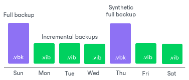

# Forward Incremental Backup

The forward incremental backup method produces a backup chain that consists of the first full backup file (VBK) and a set of forward incremental backup files (VIB) following it. Additionally, the forward incremental backup chain contains synthetic full and active full backup files that “split” the backup chain into shorter series.

Veeam Backup & Replication creates a forward incremental backup chain in the following way:

1. During the first backup job session, Veeam Backup & Replication creates a full backup file in the backup repository.
2. During subsequent backup job sessions, Veeam Backup & Replication copies only VM data blocks that have changed since the last backup job session (full or incremental) and saves these blocks as an incremental backup file in the backup chain.
3. On a day when the synthetic full or active full backup is scheduled, Veeam Backup & Replication creates a full backup file and adds it to the backup chain. Incremental restore points produced after this full backup file use it as a new starting point.
4. After adding a new restore point to the backup chain, Veeam Backup & Replication checks the retention policy set for the job. If Veeam Backup & Replication detects an outdated restore point, it attempts to remove this point from the backup chain. For more information, see [Forward Incremental Backup Retention Policy](retention_incremental_hv.md).

The forward incremental backup with synthetic full backup enabled is a default method for backup chain creation. To use the forward incremental backup method, you can leave the default settings or enable synthetic full or active full backups. If the synthetic full backup and active full backups are not enabled, Veeam Backup & Replication will produce a [forever forward incremental backup chain](incremental_forever_backup_hv.md).

Related Topics

* [Health Check for Backup Files](backup_health_check_hv.md)
* [Compact of Full Backup File](backup_compact_file_hv.md)

