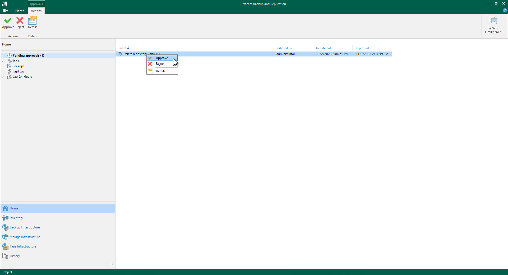
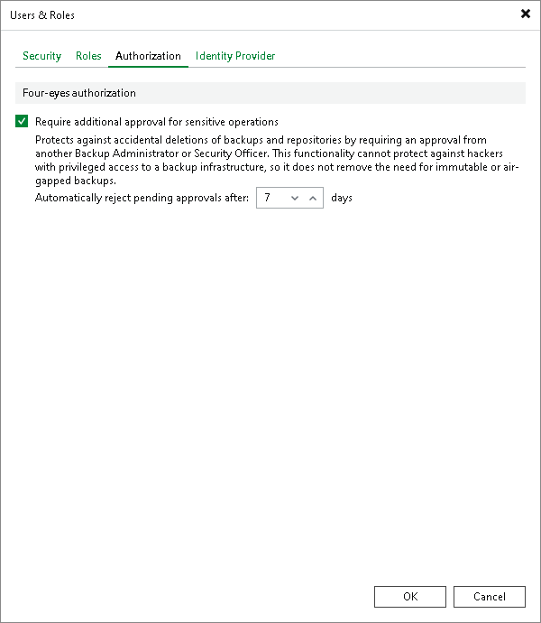
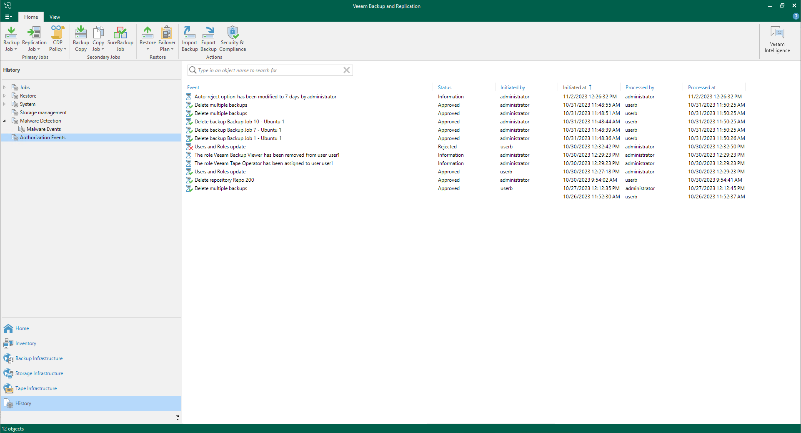

# Four-Eyes Authorization

In this article

You can enable four-eyes authorization to reduce the risk of accidental actions affecting sensitive data. This functionality requires additional approval for certain operations in Veeam Backup & Replication given by another user. To approve the request, the user must have the Veeam Backup Administrator or Veeam Security Administrator role.

|  |
| --- |
| Important |
| Before you enable the feature, make sure that you have at least two users (added to a user group or separate ones) with the Veeam Backup Administrator or Veeam Security Administrator role assigned. |

When enabled, four-eyes authorization is required to perform the following operations:

* Delete backup files or snapshots from the disk or configuration database.
* Delete information about unavailable backups from the configuration database.
* Remove backup repositories and storage from the backup infrastructure.
* Add, update and delete users or user groups.
* Enable and disable multi-factor authentication (MFA) for all users and user groups.
* Reset MFA for a specific user.
* Enable, update and disable automatic logoff for all users and user groups.
* Perform operations in the Veeam Cloud Connect infrastructure:

+ [For service providers] Remove cloud repositories and delete imported tenant backup files. Tenant backup files stored in Veeam Cloud Connect repositories cannot be deleted by service providers.
+ [For tenants] Remove service providers and delete backup files.

Consider that four-eyes authorization cannot protect the backup infrastructure if the Veeam Backup & Replication server is compromised. To build a more secure environment, follow security guidelines. For more details, see [General Security Considerations](general_security_considerations.md) and [Securing Backup Infrastructure](securing_backup_infrastructure.md).

How Four-Eyes Authorization Works

Veeam Backup & Replication supports the following scenario for four-eyes authorization:

1. A backup administrator tries to delete backup data or remove a repository from the backup infrastructure.
2. The request for additional approval is displayed in the Home view, under the Pending approvals node. Recipients specified in the global email notification settings also get email notifications. For more information, see [Configuring Global Email Notification Settings](general_email_notifications.md).
3. A backup or security administrator approves or rejects the request. If there are multiple requests, the administrator can approve or reject them simultaneously. Recipients specified in the global email notification settings also get email notifications.

|  |
| --- |
| Note |
| The backup administrator that created the request can only reject their own requests. |

If no administrators process the request till the end of the specific time period (7 days by default), it will be automatically rejected.

Requirements and Limitations

Four-eyes authorization has the following requirements and limitations:

* The functionality is included only in the Veeam Universal License or the Enterprise Plus edition. If the license expires, you will still be able to process already created requests but not to create new ones.
* If four-eyes authorization is enabled, you cannot perform the following operations:

+ Delete operations using PowerShell cmdlets, REST API, and Veeam Backup Enterprise Manager.
+ Specific operations in the Files view:

- Edit, rename and delete files
- Overwrite files
- Rename and delete folders

* If you try to approve or reject the request and the object that you want to delete is blocked by another operation, for example, by the job session, the operation will not be performed. In this case, you need to process the request later, when the object will not be blocked.
* Immutable backup files cannot be deleted even with the four-eyes authorization enabled.

Enabling Four-Eyes Authorization

To enable four-eyes authorization, perform the following steps:

1. Make sure that you have at least two users (added to a user group or separate ones) with the Veeam Backup Administrator or Veeam Security Administrator role assigned.
2. From the main menu, select Users and Roles > Authorization.
3. Select the Require additional approval for sensitive operations check box.
4. Specify the time period during which the requested operation must be approved or rejected (minimum 1 day, maximum — 30).

|  |
| --- |
| Note |
| To disable four-eyes authorization, you will also need an additional approval from another backup or security administrator. |

Viewing Authorization Events

To view events related to four-eyes authorization, open the History view and select the Authorization Events node. These events include information about:

* Approved and rejected requests
* Updated four-eyes authorization settings
* Updated settings for users and user groups
* Assigned roles
* Added or deleted users and user groups

Page updated 11/19/2025

Page content applies to build 13.0.1.1071
