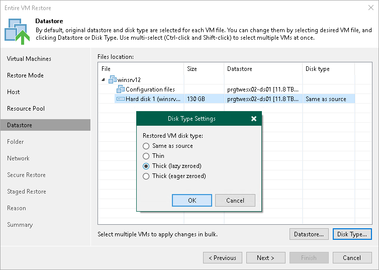

# Step 7. Select Target Datastores and Disk Types

In this article

The Datastore step of the wizard is available if you have chosen to change the location and settings for the restored VM.

You can place an entire VM to a particular datastore or choose to store configuration files and disk files of the restored VM in different locations.

1. To place VMs to a datastore, select the necessary VMs in the Files location list and click Datastore. In the Disk Type Settings window, select a datastore and click OK.

If you want to place configuration and disk files to different datastores, expand a VM in the File location list and select individual files. Then specify the necessary datastore.

1. By default, Veeam Backup & Replication preserves the format of restored VM disks. To change the disk format, expand a VM in the Files location list, select the necessary disks and click Disk Type. In the Disk Type Settings section, choose the format that will be used to restore virtual disks of the VM: same as source, thin, thick lazy zeroed or thick eager zeroed. For more information about disk types, see [VMware Docs](https://docs.vmware.com/en/VMware-vSphere/7.0/com.vmware.vsphere.vm_admin.doc/GUID-4C0F4D73-82F2-4B81-8AA7-1DD752A8A5AC.html). Click OK.

|  |
| --- |
| Note |
| Disk format change is supported only for VMs with Virtual Hardware version 7 or later. |

Z]

Page updated 8/6/2025

Page content applies to build 13.0.1.1071
