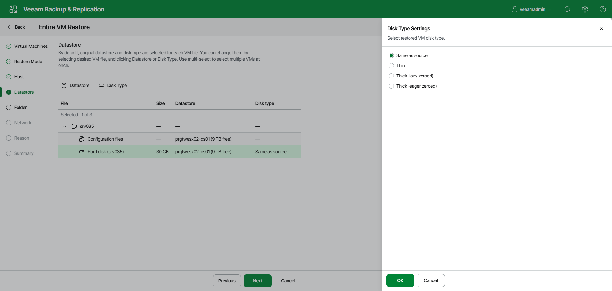

# Step 5. Select Target Datastores and Disk Types

The Datastore step of the wizard is available if you have selected Restore to a new location, or with different settings at the [Restore Mode](full_restore_mode_vm_web.md) step.

To specify disk types and where to store disks, do the following:

1. Select the necessary files in the File list and click Datastore. In the Select Datastore window, select a datastore and click OK.
2. By default, Veeam Backup & Replication preserves the format of restored VM disks. To change the disk format, select the necessary disks and click Disk Type. In the Disk Type Settings window, choose the format that will be used to restore virtual disks of the VM: same as source, thin, thick lazy zeroed or thick eager zeroed. For more information about disk types, see [VMware Docs](https://docs.vmware.com/en/VMware-vSphere/7.0/com.vmware.vsphere.vm_admin.doc/GUID-4C0F4D73-82F2-4B81-8AA7-1DD752A8A5AC.html). Click OK.

|  |
| --- |
| Note |
| Disk format change is supported only for VMs with Virtual Hardware version 7 or later. |

