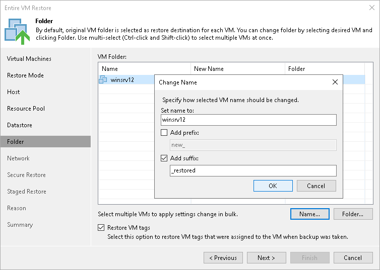

# Step 8. Select Target Folders and Change VM Settings

The Folder step of the wizard is available if you have chosen to change the location and settings for restored VMs.

At the Folder step of the wizard, specify a destination VM folder, choose whether you want to restore VM tags and change VM names. By default, Veeam Backup & Replication preserves the original names.

Specifying Destination VM Folder

To specify a destination VM folder:

1. Select a VM in the list and click Folder.
2. Choose a folder to which the VM will be placed.

|  |
| --- |
| Note |
| Consider the following:   * If you restore a VM to a standalone ESXi host that is not managed by the vCenter Server, you cannot select a destination folder: this option will be disabled. * During entire VM restore, Veeam Backup & Replication preserves the UUID of the original VM. |

Changing Names

To change a VM name:

1. Select a VM in the VM folder list and click Name.
2. In the Change Name section, enter a new name explicitly or specify a change name rule by adding a prefix or suffix to the original VM name.

Alternatively, you can change a VM name directly in the VM folder list. To do this, click the New Name field and enter the name to be assigned to the recovered VM.

Restoring VM Tags

Select the Restore VM tags check box if you want to restore tags that were assigned to the original VM and to assign them to the restored VM. Veeam Backup & Replication will restore the VM with original tags if the following conditions are met:

* The VM is restored to its original location.
* The original VM tag is still available on the source vCenter Server.

