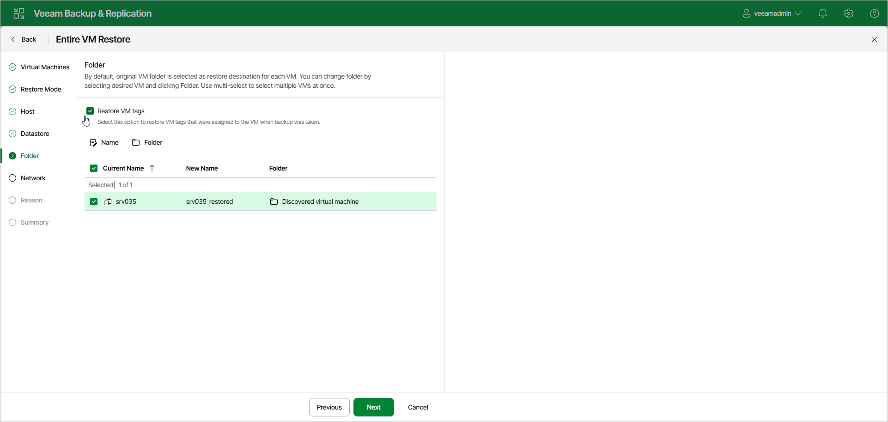
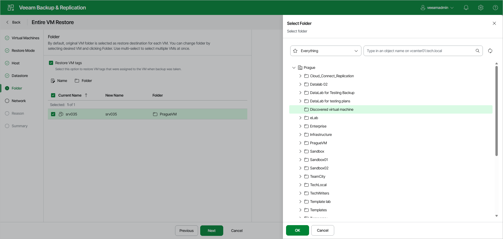
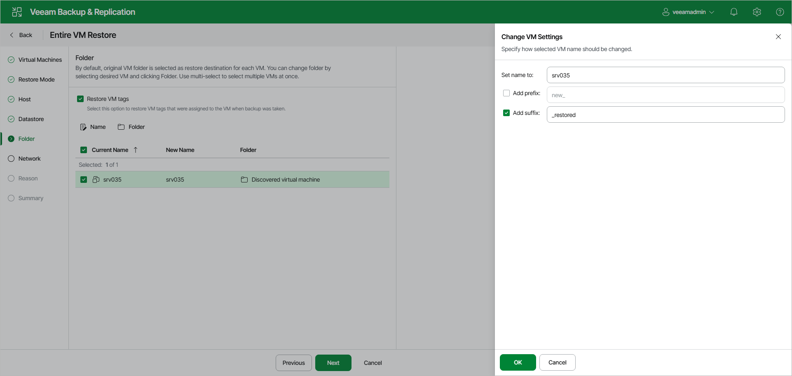

# Step 6. Select Target Folders and Change VM Settings

In this article

The Folder step of the wizard is available if you have selected Restore to a new location, or with different settings at the [Restore Mode](full_restore_mode_vm_web.md) step.

At the Folder step of the wizard, specify a destination VM folder, choose whether you want to restore VM tags and change VM names. By default, Veeam Backup & Replication preserves the original names.

Restoring VM Tags

Select the Restore VM tags check box to restore tags that were assigned to the original VM and to assign them to the restored VM. Veeam Backup & Replication will restore the VM with the original tags if the following conditions are met:

* The VM is restored to its original location.
* The original VM tag is still available on the source vCenter Server.

Specifying Destination VM Folder

To specify a destination VM folder:

1. Select VMs in the list and click Folder.
2. Choose a folder to which the VMs will be placed.
3. Click OK.

|  |
| --- |
| Note |
| Consider the following:   * If you restore a VM to a standalone ESXi host that is not managed by the vCenter Server, you cannot select a destination folder: this option will be disabled. * During entire VM restore, Veeam Backup & Replication preserves the UUID of the original VM. |

Changing Names

To change VM names:

1. Select VMs in the list and click Name.
2. In the Change VM Settings window, enter a new name explicitly or specify a change name rule by adding a prefix or suffix to the original VM name.
3. Click OK.

Page updated 11/19/2025

Page content applies to build 13.0.1.1071
