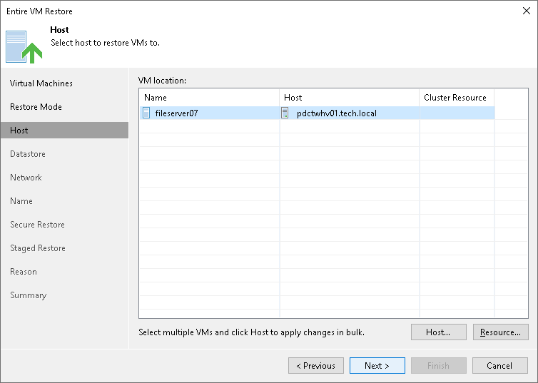

# Step 5. Select Target Hosts

In this article

The Host step of the wizard is available if you have chosen to change the location and settings for the restored VM.

To specify a target host:

1. Select the necessary VMs in the VM location list and click Host.
2. Choose a standalone or clustered host where the selected VMs must be registered.

If you choose to register the restored VM on a host being a part of a Hyper-V failover cluster, you can specify additional failover settings.

1. Select a VM in the list and click Resource.
2. Select the Register VM as a cluster resource option if the restored VM must be configured as a cluster resource. In this case, if the target host is brought offline or fails for any reason, the VM will fail over to another node in the cluster.

Page updated 8/6/2025

Page content applies to build 13.0.1.1071
