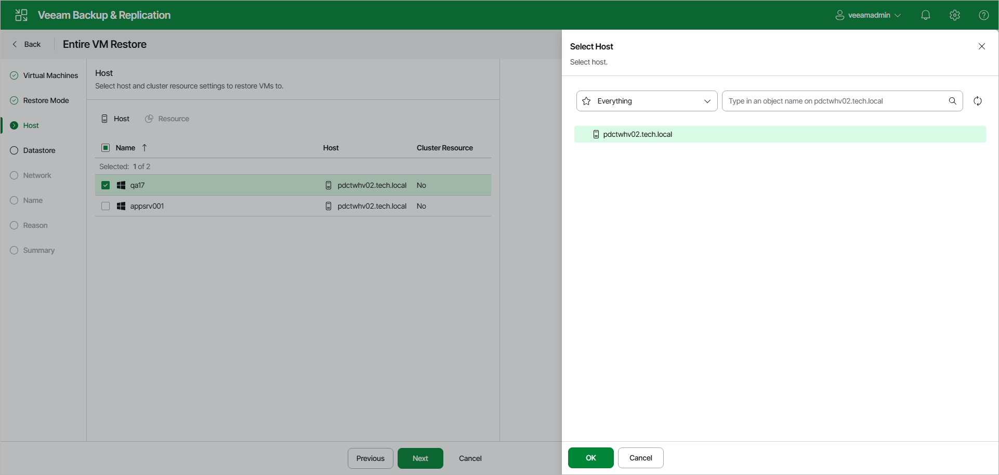

# Step 4. Select Target Hosts

The Host step of the wizard is available if you have selected Restore to a new location, or with different settings at the [Restore Mode](full_restore_mode_hv_web.md) step.

To specify a target host:

1. Select the necessary VMs in the list and click Host.
2. Choose a standalone or clustered host where the selected VMs must be registered.
3. Click OK to save the changes.

If you choose to register the restored VM on a host that is a part of a Hyper-V failover cluster, you can specify additional failover settings.

1. Select a VM in the list and click Resource.
2. Select the Register VM as a cluster resource option if the restored VM must be configured as a cluster resource. In this case, if the target host is brought offline or fails for any reason, the VM will fail over to another node in the cluster.

