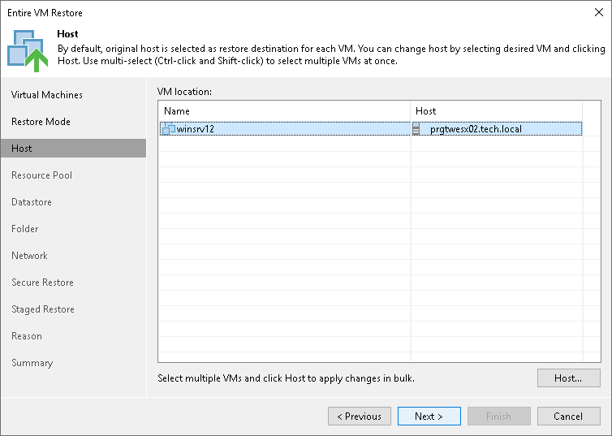

# Step 5. Select Target Hosts

The Host step of the wizard is available if you have chosen to change the location and settings for the restored VM.

To specify a target host:

1. Select the necessary VMs in the list and click Host.
2. Choose a host or cluster where the selected VMs must be registered.

