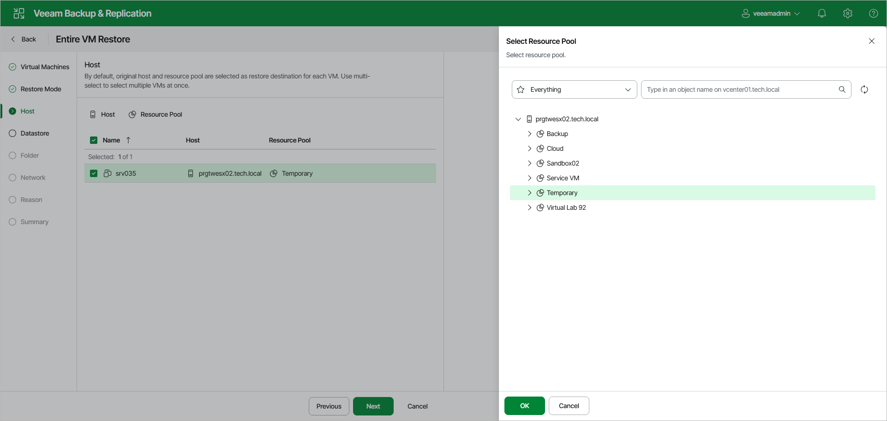

# Step 4. Select Target Hosts and Resource Pools

In this article

The Host step of the wizard is available if you have selected Restore to a new location, or with different settings at the [Restore Mode](full_restore_mode_vm_web.md) step.

In the list, select the necessary VMs. Click Host to specify the host where the VMs will be recovered or click Resource Pool to specify a resource pool. To save the changes, click OK.

Page updated 8/6/2025

Page content applies to build 13.0.1.1071
