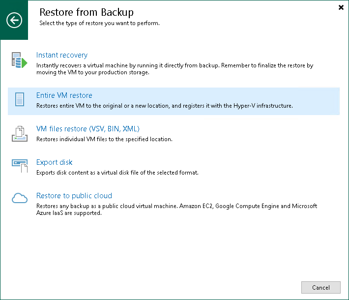

# Step 1. Launch Entire VM Restore Wizard

To launch the Entire VM Restore wizard, do one of the following:

* On the Home tab, click Restore > <Platform> > Restore from backup > Entire VM restore > Entire VM restore.
* Open the Home view. In the inventory pane, select Backups. In the working area, expand the necessary backup and select the machine that you want to restore and click Entire VM on the ribbon. Alternatively, right-click the machine that you want to restore and select Restore entire VM > <Platform>.

