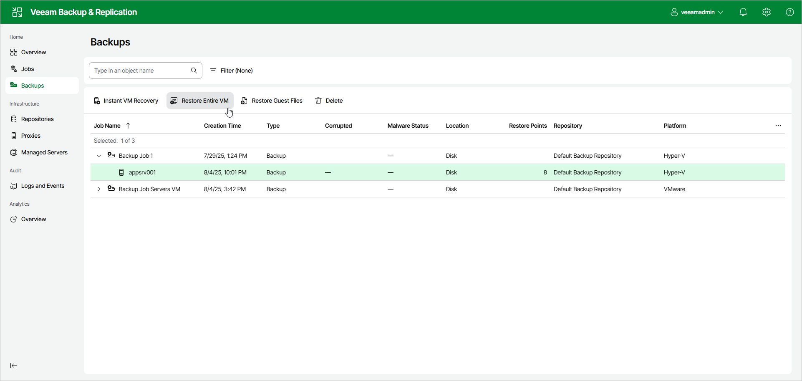

# Step 1. Launch Full VM Restore Wizard

To launch the Entire VM Restore wizard using the web UI, do the following:

1. In the management pane, select Backups.
2. In the working area, select VMs that you want to recover.
3. Click Restore Entire VM. Alternatively, you can right-click one of the selected VMs and click Restore Entire VM.

