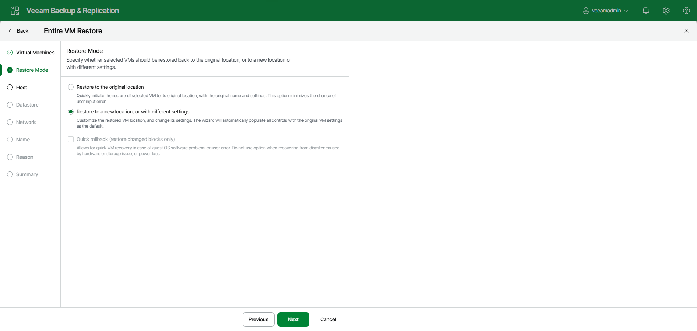

# Step 3. Select Restore Mode

In this article

At the Restore Mode step of the wizard, choose the necessary restore mode:

1. Choose a restore mode:

* Select Restore to the original location if you want to restore VMs with their initial settings and to their original location. If you select this option, you will immediately pass to the [Reason step](full_restore_reason_hv.md) of the wizard.

During restore to the original location, Veeam Backup & Replication deletes the original VMs and restores VMs with the original identifiers. This means that after the restore finishes, you do not need to update jobs that process the original VMs.

* Select Restore to a new location, or with different settings if you want to restore VMs to a different location or with different settings (such as VM location, network settings, and so on). If you select this option, the Full VM Restore wizard will include additional steps for customizing VMs settings.

If you restore VMs to the same host and select to preserve VM UUIDs, you do not need to update existing jobs that process the original/recovered VMs; the jobs will still be working. If you configure restore in another way and want to process the restored VMs, you must edit the existing jobs or create new jobs to process the recovered VMs.

|  |
| --- |
| Important |
| If you recover a machine to the original location, consider that the VM settings contain the ID of the VM group to which the machine belongs. To restore the machine to the original VM group, you must not delete the original VM group or change the hierarchy of its parent VM groups. |

1. [For VM restore to the original location] Select the Quick rollback check box if you want to perform incremental restore for the VM. Veeam Backup & Replication will use CBT to get data blocks that are necessary to revert the VM to an earlier point in time, and will restore only these data blocks from the backup. Quick restore significantly reduces the restore time and has little impact on the production environment.

You should enable this option if you restore a VM after a problem that occurred at the level of the VM guest OS. For example, there has been an application error or a user has accidentally deleted a file on the VM guest OS. Do not enable this option if the problem has occurred at the VM hardware level, storage level or due to a power loss.

For more information on quick rollback, its requirements and limitations, see [Quick Rollback](incremental_restore_hv.md).

Page updated 11/19/2025

Page content applies to build 13.0.1.1071
