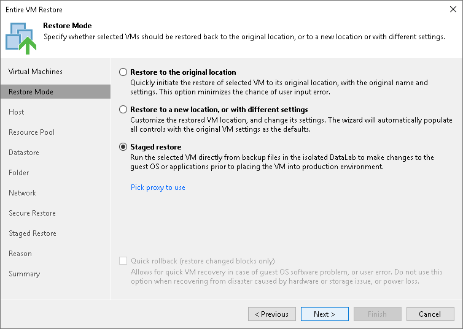

# Step 4. Select Restore Mode

At the Restore Mode step of the wizard, choose the necessary restore mode and backup proxy to transfer VM data:

1. Choose a restore mode:

* Select Restore to original location to restore VMs with their initial settings and to their original location. If this option is selected, you will immediately pass to the [Reason step](full_restore_reason_vm.md) of the wizard.

During restore to the original location, Veeam Backup & Replication restores only those disks that are included in the backup file. This means that after the restore finishes, you do not have to update existing jobs which process the original VMs.

* Select Restore to a new location, or with different settings to restore VMs to a different location or with different settings (such as VM location, network settings, format of restored virtual disks and so on). If this option is selected, the Full VM Restore wizard will include additional steps for customizing VMs settings.

During restore to a new location, Veeam Backup & Replication creates new VMs. If you want to process the restored VMs, you must edit existing jobs or create new jobs to process the restored VMs. If you restore VMs with the same name and to the same folder as the original VMs, Veeam Backup & Replication deletes the original VMs. In this case, you must edit existing jobs to exclude original VMs from them.

* Select Staged restore to run an executable script for VMs before restoring them to the production environment. If this option is selected, the Full VM Restore wizard will include an additional step for customizing staged restore settings.

During staged restore to the original location, that is, when you leave the original settings on the next steps of the wizard, Veeam Backup & Replication removes the original VMs. However, Veeam Backup & Replication automatically updates the existing jobs to process the restored VMs and to exclude the original VMs.

During staged restore to a new location, Veeam Backup & Replication creates new VMs. If you want to process the restored VMs, you need to edit existing jobs or create new jobs.

1. [For VM restore to the original location] Select the Quick rollback check box to perform incremental restore for the VM. Veeam Backup & Replication will query CBT to get data blocks that are necessary to revert the VM to an earlier point in time, and will restore only these data blocks from the backup. Quick restore significantly reduces the restore time and has little impact on the production environment.

It is recommended that you enable this option if you restore a VM after a problem that occurred at the level of the VM guest OS: for example, there has been an application error or a user has accidentally deleted a file on the VM guest OS. Do not enable this option if the problem has occurred at the VM hardware level, storage level or due to a power loss.

For more information on quick rollback, its requirements and limitations, see [Quick Rollback](incremental_restore.md).

1. Click the Pick proxy to use link to select backup proxies over which VM data must be transported to the target datastore. You can assign backup proxies explicitly or instruct Veeam Backup & Replication to automatically select backup proxies.

* If you choose Automatic selection, Veeam Backup & Replication will detect backup proxies that are connected to the target datastore and will automatically assign optimal proxy resources for processing VM data.

During the restore process, VMs are processed simultaneously. Veeam Backup & Replication checks available backup proxies. If more than one backup proxy is available, Veeam Backup & Replication analyzes transport modes that the backup proxies can use for writing data to target, current workload on these backup proxies, and selects the most appropriate resources for VMs processing.

* If you choose Use the selected backup proxy servers only, you can explicitly select backup proxies that will be used for restore. It is recommended that you select at least two proxies to ensure that VMs are recovered should one of backup proxies fail or lose its connectivity to the target datastore during restore.

Restoring Storage Policies

If the backed-up VM was associated with the storage policy, in the restore to original location scenario, Veeam Backup & Replication will associate the restored VM with this storage policy.

When you click Next, Veeam Backup & Replication will check storage policies in the virtual environment and compare this information with the information about the storage policy in the backup file. If the original storage policy has been changed or deleted, Veeam Backup & Replication will display a warning. You can select one of the following options:

* Current — the restored VM will be associated with the profile with which the original VM in the production environment is currently associated.
* Default — the restored VM will be associated with the profile that is set as default for the target datastore.
* Stored — the restored VM will be associated with the profile that was assigned to the original VM at the moment of backup, and whose information is stored in the backup file.

For more information, see [Storage Policies](storage_profile_restore.md).

