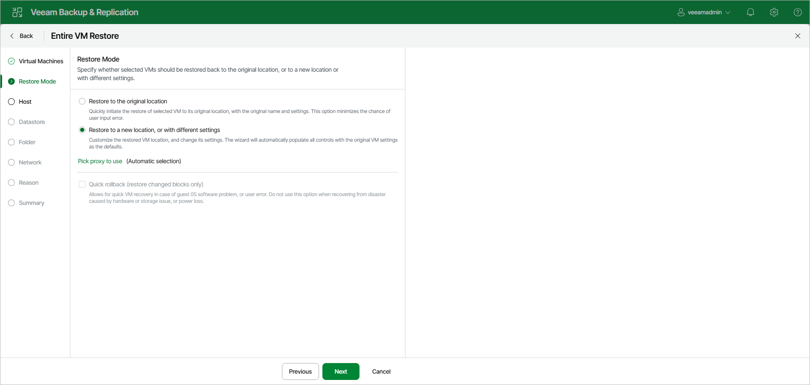

# Step 3. Select Restore Mode

In this article

At the Restore Mode step of the wizard, choose the necessary restore mode and backup proxy to transfer VM data:

1. Choose a restore mode:

* Select Restore to the original location to restore VMs with their initial settings and to their original location. If you select, you will immediately pass to the [Reason step](full_restore_reason_vm_web.md) of the wizard.

During restore to the original location, Veeam Backup & Replication restores only those disks that are included in the backup file. This means that after the restore finishes, you do not have to update existing jobs which process the original VMs.

* Select Restore to a new location, or with different settings to restore VMs to a different location or with different settings (such as VM location, network settings, format of restored virtual disks and so on). If this option is selected, the Full VM Restore wizard will include additional steps for customizing VMs settings.

During restore to a new location, Veeam Backup & Replication creates new VMs. To process the restored VMs, you must edit existing jobs or create new jobs. If you restore VMs with the same name and to the same folder as the original VMs, Veeam Backup & Replication deletes the original VMs. In this case, you must edit existing jobs to exclude original VMs from them.

1. [For VM restore to the original location] Select the Quick rollback check box to perform incremental restore for the VM. Veeam Backup & Replication will query CBT to get data blocks that are necessary to revert the VM to an earlier point in time, and will restore only these data blocks from the backup. Quick restore significantly reduces the restore time and has little impact on the production environment.

You should enable this option if you restore a VM after a problem that occurred at the level of the VM guest OS. For example, there has been an application error or a user has accidentally deleted a file on the VM guest OS. Do not enable this option if the problem has occurred at the VM hardware level, storage level or due to a power loss.

For more information on quick rollback, its requirements and limitations, see [Quick Rollback](incremental_restore.md).

1. Click Pick proxy to use to select backup proxies over which VM data must be transported to the target datastore. You can assign backup proxies explicitly or instruct Veeam Backup & Replication to automatically select backup proxies.

* If you choose Automatic selection, Veeam Backup & Replication will detect backup proxies connected to the target datastore and will automatically assign optimal proxy resources for processing VM data.

During the restore process, VMs are processed simultaneously. Veeam Backup & Replication checks available backup proxies. If more than one backup proxy is available, Veeam Backup & Replication analyzes the transport modes that the backup proxies can use for writing data to target, current workload on these backup proxies, and selects the most appropriate resources for VMs processing.

* If you choose Use the selected backup proxy servers only, you can explicitly select backup proxies that will be used for restore. You should select at least two proxies to ensure that VMs are recovered if one of backup proxies fails or loses its connectivity to the target datastore during restore.

Page updated 11/19/2025

Page content applies to build 13.0.1.1071
