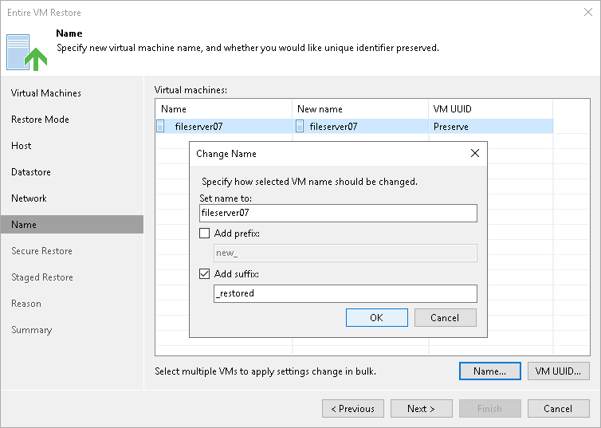

# Step 8. Change VM Names and UUIDs

The Name step of the wizard is available if you have chosen to change the location and settings for recovered VMs.

At the Name step of the wizard, specify names under which VMs will be recovered and select whether you want to preserve VM UUIDs or change them. By default, Veeam Backup & Replication preserves the original names and UUIDs.

|  |
| --- |
| Note |
| We recommend that you specify a new name and generate a new UUID for a VM to prevent conflicts if the original workload still resides in the production environment. The name and UUID change is not required if the original workload no longer exists, for example, it was permanently deleted. |

Changing Names

To change a VM name:

1. In the Virtual machines list, select the necessary VMs and click Name.
2. In the Change Name section, enter a new name explicitly or specify a change name rule by adding a prefix or suffix to the original workload name.

Alternatively, you can change a VM name directly in the Virtual machines list. To do this, click the New Name field and enter the name to be assigned to the recovered VM.

Changing UUIDs

To change VM identification settings:

1. Select the necessary VMs in the list and click VM UUID.
2. In the BIOS UUID Settings window, select if you want to preserve or generate a new UUID.

