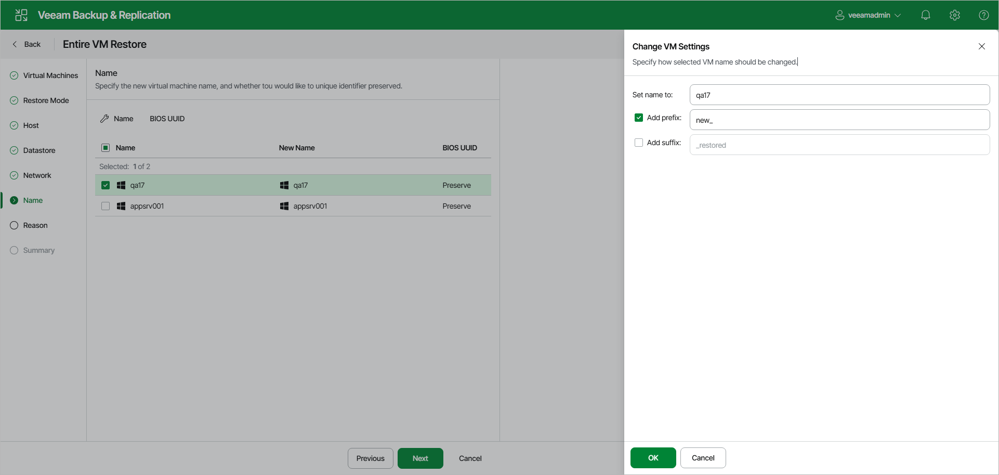

# Step 7. Change VM Names and UUIDs

In this article

The Name step of the wizard is available if you have selected Restore to a new location, or with different settings at the [Restore Mode](full_restore_mode_hv_web.md) step.

To configure VM settings:

1. To specify new VM names, select the necessary VMs in the list and click Name. In the Change VM Settings window, enter a new name explicitly or specify a change name rule by adding a prefix or suffix to the original VM name.
2. To configure the VM BIOS UUID, select the necessary VMs in the list and click BIOS UUID. In the BIOS UUID Settings window, choose to generate a new UUID or preserve the existing one.

Page updated 11/19/2025

Page content applies to build 13.0.1.1071
