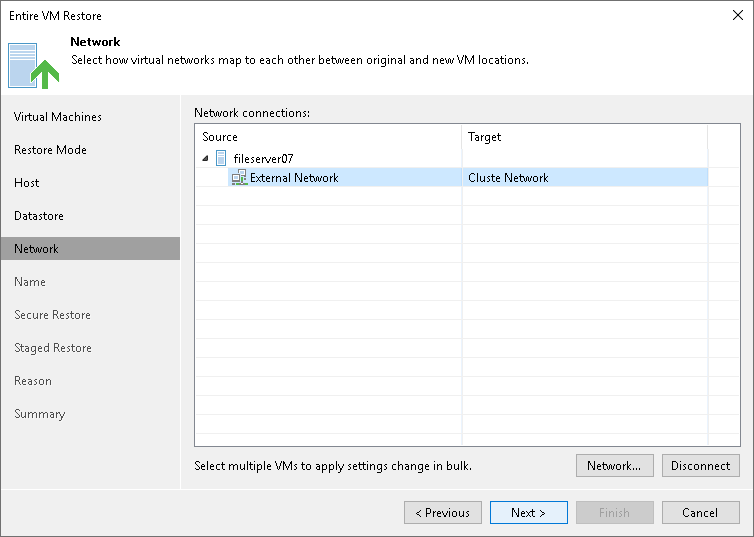

# Step 7. Specify Network Mapping

The Network step of the wizard is available if you have chosen to change the location and settings for the restored VM.

If you plan to restore a VM to a new location, for example, another site with a different set of networks, you can map source site networks to target site networks. Veeam Backup & Replication will use the network mapping table to update configuration files of the VM on the fly, during the restore process.

To change networks to which the restored VM will be connected:

1. Select a VM in the list and click Network. To apply changes in bulk, select several VMs in the list and click Network.

If a VM is connected to multiple networks, expand the VM, select the network to map and click Network. The Select Network section displays all networks to which the target host or cluster is connected.

1. From the list of available networks, choose a network to which the VM must have access upon restore.

If you do not want to connect a restored VM to your virtual networks, select the VM in the list and click Disconnected.

