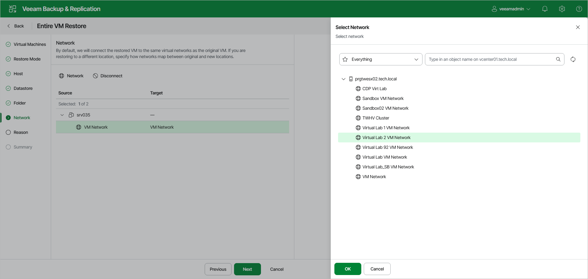

# Step 7. Configure Network Mapping

The Network step of the wizard is available if you have selected Restore to a new location, or with different settings at the [Restore Mode](full_restore_mode_vm_web.md) step.

If you plan to restore a VM to a new location, for example, another site with a different set of networks, you can map the source site networks to the target site networks. Veeam Backup & Replication will use the network mapping table to update the VM configuration files on the fly during the restore process..

To change the networks to which the restored VM will be connected:

1. Select the necessary networks in the list and click Network.
2. From the list of available networks, choose a network to which the VM must have access upon restore.
3. Click OK to save the changes.

If you do not want to map a network to your virtual network, select the network in the list and click Disconnect.

