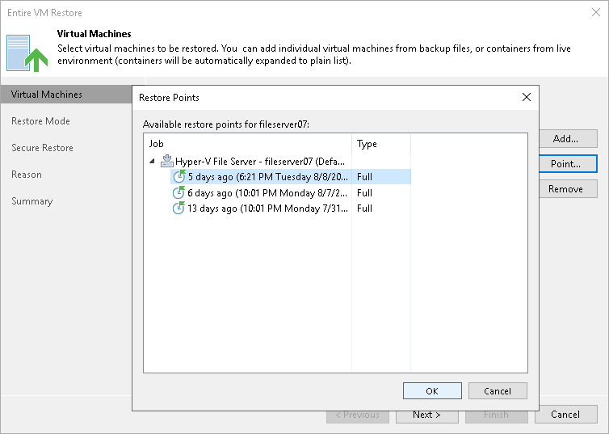

# Step 3. Select Restore Points

In this article

By default, Veeam Backup & Replication uses the latest valid restore point. However, you can restore the VM to an earlier state. If you have chosen to restore several VMs, you can select the necessary restore point for each VM in the list.

To select a restore point for a VM:

1. In the Virtual machines to restore list, select a VM.
2. Click Point on the right.
3. In the Restore Points window, select a restore point from which you want to restore the VM.

Related Topics

* [Backup Repository](backup_repository.md)
* [Object Storage Repository](object_storage_repository.md)

Page updated 8/6/2025

Page content applies to build 13.0.1.1071
