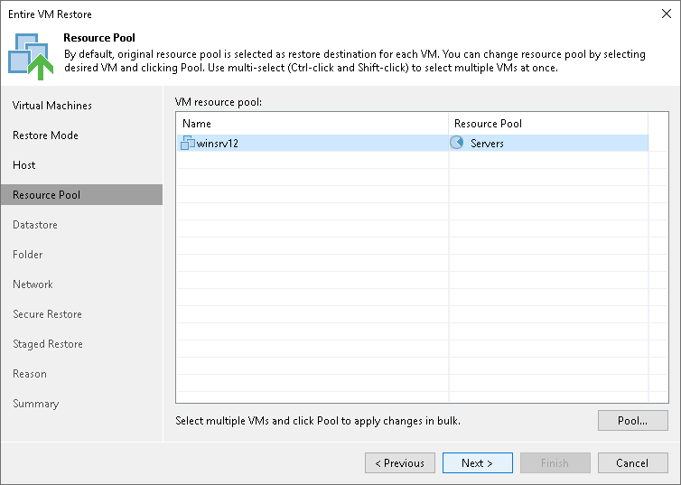

# Step 6. Select Target Resource Pools

The Resource Pool step of the wizard is available if you have chosen to change the location and settings for the restored VM.

To specify a destination resource pool:

1. Select the necessary VMs in the list and click Pool.
2. Select a resource pool to which the VMs must be placed.
3. If necessary, select a vApp in which the VMs must be included.

