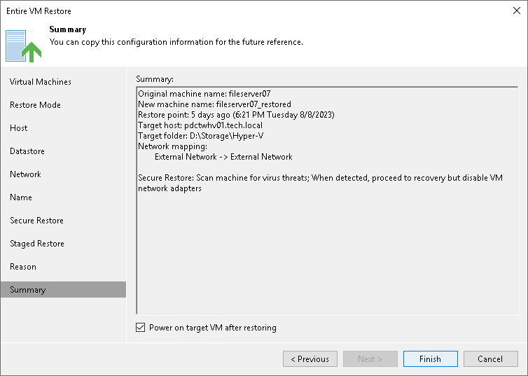

# Step 12. Verify Restore Settings

At the Summary step of the wizard, check restore settings and click Finish. If you want to start the recovered VMs on the target host, select the Power on VM after restoring check box.

