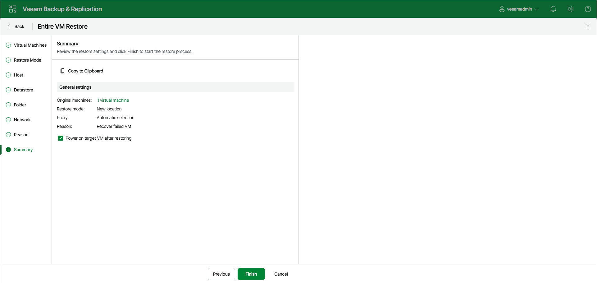

# Step 9. Verify Restore Settings

At the Summary step of the wizard, review the restore settings and click Finish. If you want to start the recovered VMs on the target host, select the Power on target VM after restoring check box.

